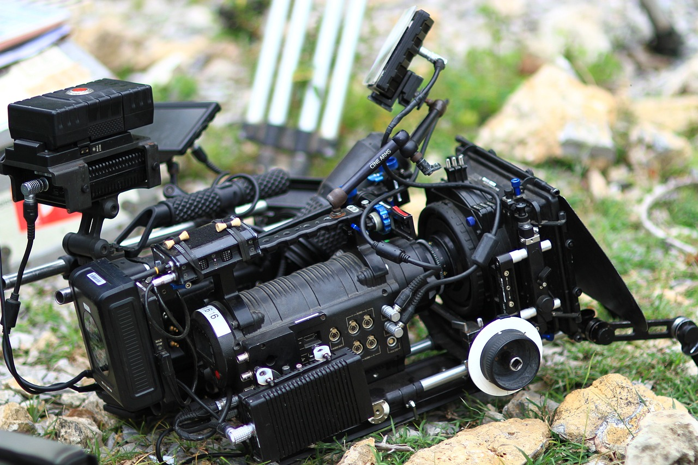
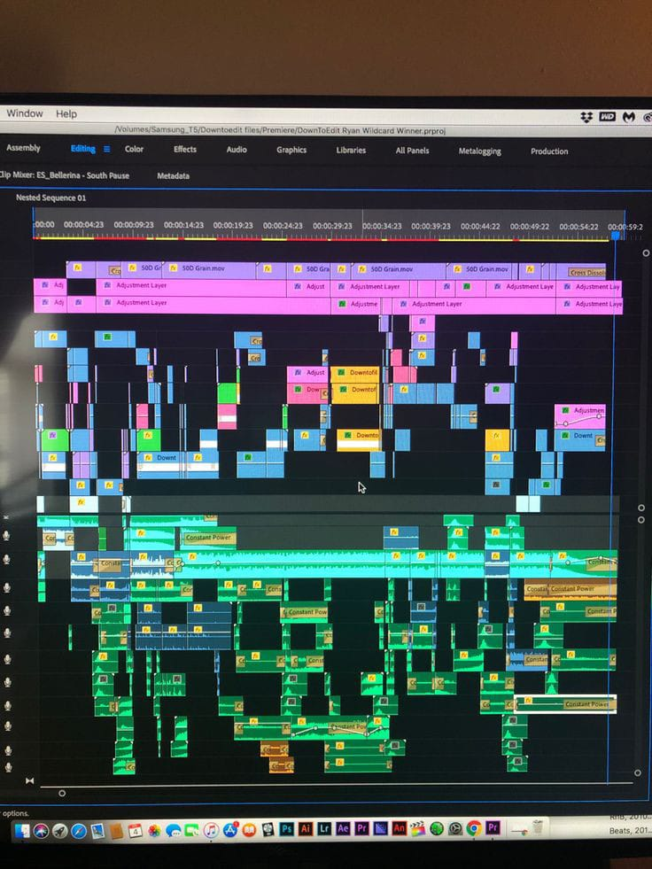

<!-- Proyectos -->
  <!--<section  class="container mt-5">
        <h2 class="text-center">MÓDULOS</h2>
        

            

                

                    
                    

                        <h5 class="card-title">Estilos</h5>
                        <a href="./vistas/estilos.html" class="btn btn-primary">Ver Más</a>
                    

                

            

            

                

                    
                    

                        <h5 class="card-title">guiones</h5>
                        <a href="./vistas/guiones.html" class="btn btn-primary">Ver Más</a>
                    

                

            

            

                

                    
                    

                        <h5 class="card-title">Produccion</h5>
                        <a href="./vistas/produccion.html" class="btn btn-primary">Ver Más</a>
                    

                

            

            

                

                    
                    

                        <h5 class="card-title">Edicion</h5>
                        <a href="./vistas/edicion.html" class="btn btn-primary">Ver Más</a>
                    

                

            

        

  </section> -->
 

<!-- dashboard -->
<!--  <nav class="navbar navbar-expand-lg navbar-dark px-5 ">
        
        <button
          class="navbar-toggler"
          type="button"
          data-bs-toggle="collapse"
          data-bs-target="#navbarNav"
          aria-controls="navbarNav"
          aria-expanded="false"
          aria-label="Toggle navigation"
        >
          
        </button>
        

          
 
          <ul class="navbar-nav ms-auto  pt-4 "> 
            <li class="nav-item dropdown ">
              <a class="nav-link dropdown-toggle" href="#" role="button" data-bs-toggle="dropdown" aria-expanded="false">
                Modulos
              </a>
              <ul class="dropdown-menu  ">
                <li><a class="dropdown-item" href="../vistas/estilos.html">Estilos</a></li>
                <li><a class="dropdown-item" href="../vistas/guiones.html">guiones</a></li>
                <li><a class="dropdown-item" href="../vistas/produccion.html">Produccion</a></li>
                <li><a class="dropdown-item" href="../vistas/edicion.html">Edicion</a></li>
              </ul>
            </li>
            <li class="nav-item"><a class="nav-link" href="./vistas/quienes-somos.html">Nosotros</a></li>
            <li class="nav-item">
              <a class="nav-link " href="#">Certificación</a>
            </li>
            <li class="nav-item"><a class="nav-link" href="./vistas/noticias.html">Blog</a></li>
          </ul>

          <li class="nav-item dropdown ">
            <a class="nav-link dropdown-toggle" href="#" role="button" data-bs-toggle="dropdown" aria-expanded="false">
              <i class="fa-regular fa-circle-user "></i>
            </a>

            

            <ul class="dropdown-menu ">
              <li><h5 id="saludo"></h5></li>
              <li><a class="dropdown-item" href="./cerrando.html">
                <button class="btn btn-outline-info">cerrar
              sesion</button></a></li>
            </ul>
          </li>

         
          
        

  </nav> -->

  <!-- 

    

      <h1 class="offcanvas-title">Heading</h1>
      <button type="button" class="btn-close" data-bs-dismiss="offcanvas"></button>
    

    

      
Some text lorem ipsum.

      
Some text lorem ipsum.

      
Some text lorem ipsum.

      <button class="btn btn-secondary" type="button">A Button</button>
    

  

  
  

    <h3>Offcanvas Sidebar</h3>
    
Offcanvas is similar to modals, except that it is often used as a sidebar.

    <button class="btn btn-warning" type="button" data-bs-toggle="offcanvas" data-bs-target="#demo">
      Open Offcanvas Sidebar
    </button>
  
 -->

<!--   .profile-userpic img {
  float: none;
  margin: 0 auto;
  height: 60%;
  width: 60%;
  -webkit-border-radius: 50% !important;
  -moz-border-radius: 50% !important;
  border-radius: 60% !important;
} -->
